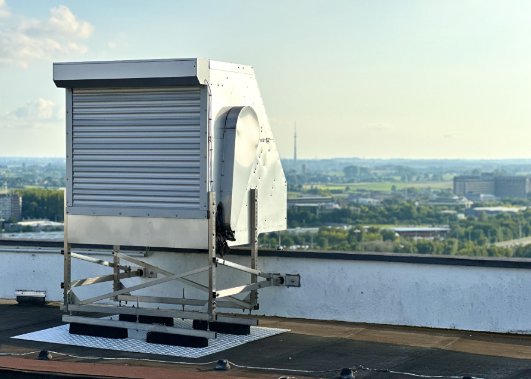
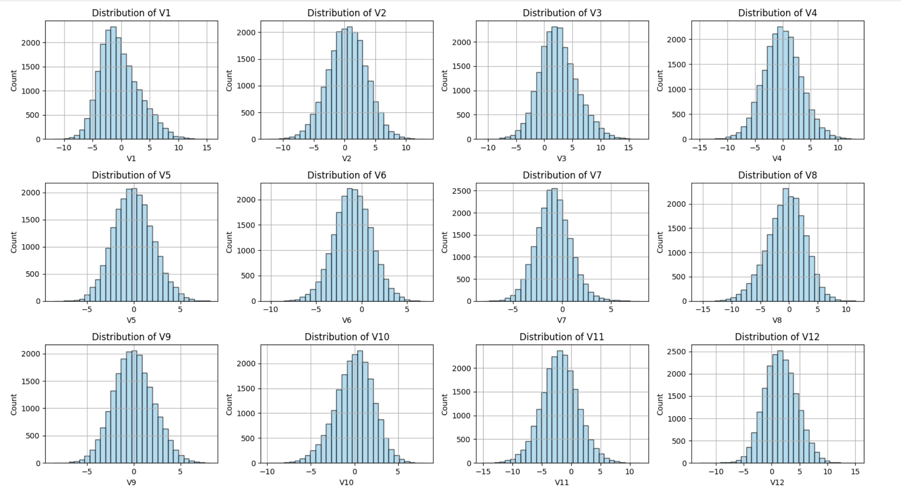
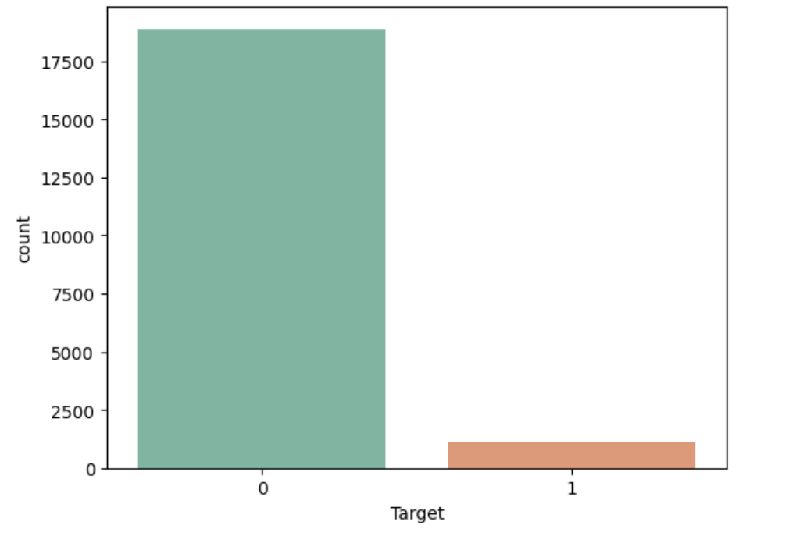
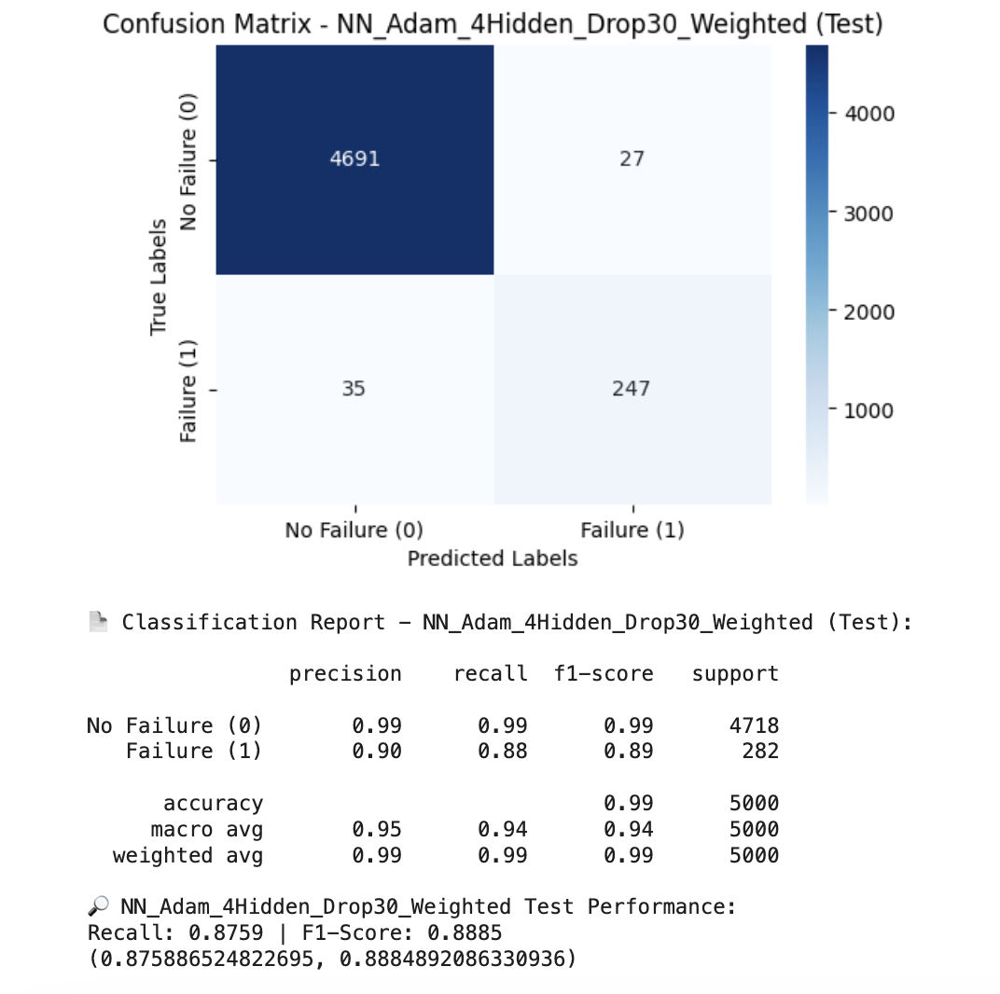

# 🌪ReneWind — Neural Networks for Turbine Failure Prediction

  

*A neural network–based predictive maintenance solution to identify turbine failures before they happen.*

  

---

## Project Overview & Motivation
Wind energy has become a critical part of the renewable energy mix, but turbines are complex machines that are costly to repair and maintain. **Unexpected failures not only cause downtime but can cost thousands of dollars per hour in lost productivity**.  

ReneWind, a leading energy provider, wanted to leverage **sensor data collected from turbines** to anticipate failures before they occurred. By building a machine learning–based system, the company aimed to:  
- **Reduce unplanned downtime** through early warnings.  
- **Optimize maintenance schedules** with predictive insights.  
- **Improve safety and reliability** by catching failures before they escalate.

This project applies **artificial neural networks (ANNs)** to historical turbine data to predict failures. Given the rarity of failures, the business goal was to **maximize recall** — ensuring that as many true failures as possible were identified, even if it meant accepting some false alarms.

---

## Objective
The primary objective is to develop a neural network–based classifier that predicts whether a turbine will **fail (1)** or **not fail (0)**.  

From a business perspective:  
- **False negatives (missed failures)** are extremely costly, since they lead to downtime and expensive repairs.  
- **False positives (incorrectly flagged failures)** are less damaging, since they only trigger additional inspections.

For the business - the maintenance cost is defined as:  

\[
\text{Maintenance Cost} = TP \times (Repair\ Cost) + FN \times (Replacement\ Cost) + FP \times (Inspection\ Cost)
\]

Where:  
- **Repair cost = $15,000** (for correctly predicted failures → TP).  
- **Replacement cost = $40,000** (for missed failures → FN).  
- **Inspection cost = $5,000** (for false alarms → FP).  

The **minimum achievable cost** is:  

\[
\text{Minimum Cost} = (TP + FN) \times (Repair\ Cost)
\]

👉 Therefore, the model was designed to prioritize **recall** while maintaining a good **F1 Score** to balance precision and recall.  

---

## Dataset
- **Training set:** ~20,000 records  
- **Test set:** ~5,000 records  
- **Features:** 40 predictor variables (ciphered/transformed sensor readings)  
- **Target:** `Failure` — binary indicator of turbine failure (1) or normal operation (0)  
- **Class distribution:** Failures were rare compared to non-failures, creating a strong **class imbalance** problem.  

Because features were anonymized, their physical meaning is unknown, but they retain predictive signal for classification.  

---

## Key Data Observations (EDA Highlights)
- **Distribution:** Most predictor variables followed a roughly normal distribution.

  

- **Imbalance:** Failures represented only a small percentage of the dataset, making imbalance handling critical.

  

- **Failure vs Non-failure patterns:** Certain predictors showed separation between failing and non-failing turbines in boxplots and histograms, suggesting useful signal.  
- **Outliers:** Present but retained, as rare abnormal readings could correspond to early failure indicators.  

These insights guided preprocessing and modeling choices, especially the emphasis on **recall**.

---

## Data Preprocessing
To prepare the dataset for neural network modeling, the following steps were taken:  

- **Train-validation split:** Data split into **70% training and 30% validation**, using stratified sampling to maintain the imbalance ratio.  
- **Scaling:** Features standardized to stabilize gradient descent in neural networks.  
- **Class imbalance handling:**  
  - Baseline models were trained without resampling.  
  - **Class weights** were later applied during training to give more importance to minority class (failures).  

This ensured models learned to detect failures without overfitting to the majority class.

---

## Modeling Approach
Multiple ANN architectures were tested, varying in depth, width, regularization, and optimizer choice:  

- **SGD-based models:** Provided baseline comparisons (`NN_SGD_2Hidden`, `NN_SGD_DeepWide`).  
- **Adam-based models:** Improved convergence speed and stability (`NN_Adam_4Hidden`).  
- **Dropout regularization:** 30% dropout layers added to reduce overfitting.  
- **Weighted models:** Incorporated class weights to penalize missed failures.  

Representative examples:  
- **NN_SGD_2Hidden_Drop30** – a shallow net with dropout.  
- **NN_Adam_4Hidden_Drop30_Weighted** – deeper network with Adam optimizer, dropout, and class weighting (eventually chosen as best).  
- **NN_SGD_DeepWide** – larger architecture to test capacity improvements.  

Each variant was evaluated on recall, precision, and F1 Score to balance predictive performance and business requirements.  

---

## Training & Hyperparameters
- **Optimizers:**  
  - *SGD* (Stochastic Gradient Descent) for baseline interpretability.  
  - *Adam* for adaptive learning rates and faster convergence.  
- **Epochs:** Typically 50–100, with performance monitored to avoid overfitting.  
- **Batch size:** 32–64.  
- **Regularization:** 30% dropout layers reduced overfitting risk.  
- **Class weighting:** Applied to give more importance to minority failure class.  
- **Metrics tracked:** Accuracy, Precision, Recall, and F1 Score (with recall emphasized).  

Training logs confirmed that Adam-based models with class weighting achieved higher recall and F1 compared to their unweighted counterparts.

---

## Evaluation Metrics
- **Accuracy** was not prioritized due to imbalance; it would misleadingly favor majority predictions.  
- **Recall** was the most critical metric: missing a failure (false negative) is costly.  
- **Precision** ensured flagged failures were credible, preventing too many false alarms.  
- **F1 Score** balanced recall and precision, serving as the primary selection criterion.  

👉 **Final model selection was based on F1 Score, with strong preference given to recall.**

---

## Model Comparison Results
Final validation performance across architectures:

## 📊 Model Comparison Results (Revised with Cost Implications)

| Model                              | Train Recall | Train F1 | Val Recall | Val F1 | Cost Alignment |
|-----------------------------------|--------------|----------|------------|--------|----------------|
| **NN_Adam_4Hidden_Drop30_Weighted** | 0.922        | 0.919    | **0.899**  | **0.891** | Best balance — lowest projected cost due to high recall, fewer replacements |
| NN_Adam_WideHeavy_Drop40_Weighted | 0.927        | 0.918    | 0.896      | 0.881  | Strong, but slightly more FN → higher replacement costs |
| NN_SGD_2Hidden_Drop30_Weighted    | 0.920        | 0.928    | 0.890      | 0.892  | Competitive; slightly higher cost due to more FN than best model |
| NN_Adam_2Hidden_Drop30_Weighted   | 0.923        | 0.904    | 0.896      | 0.858  | Decent recall, but lower F1 → more FP costs from false alarms |

## Final Model Selection

The final model chosen was **NN_Adam_4Hidden_Drop30_Weighted**, which achieved:  
- **Validation Recall:** 0.899 (~90%)  
- **Validation F1 Score:** 0.891 (~89%)

  

From a cost perspective, this model delivers the **lowest projected maintenance cost**:  

\[
\text{Maintenance Cost} = TP \times \$15,000 + FN \times \$40,000 + FP \times \$5,000
\]

- **High Recall (~90%)** → Most failures detected early, reducing $40K replacements.  
- **Balanced Precision & F1** → Keeps false alarms manageable, limiting $5K inspections.  
- **Close to theoretical minimum cost** → Where all failures are repairs at $15K each.  

This model was selected because it best aligns with the **business objective of reducing total maintenance costs** while maintaining reliability.  

---

## Actionable Business Insights (Focused on Final Model)

1. **Failure Detection:**  
   The model identifies ~90% of failures in advance, converting costly **$40K replacements** into cheaper **$15K repairs**.  

2. **Cost Reduction:**  
   - Per 1,000 failure events, the model prevents ~50 missed failures compared to baselines.  
   - This translates to **~$2M in savings** from avoided replacements.  
   - Additional inspections add ~$0.5M, but net impact is strongly positive.  

3. **Operational Reliability:**  
   - Technicians can prioritize turbines flagged with high failure probability.  
   - Ensures downtime is minimized and parts/crew are allocated proactively.  

4. **Strategic ROI:**  
   - Maintenance costs are shifted **closer to the theoretical minimum**.  
   - With more labeled data, performance could surpass 90% recall, further reducing costs.  
   - Positions ReneWind as a **data-driven leader in predictive maintenance**.  

---

##  Impact Summary (Final Model)

- **~90% of turbine failures predicted in advance.**  
- **Projected maintenance cost formula:**  
  \[TP × $15,000 + FN × $40,000 + FP × $5,000\]  
- **Baseline (~85% recall):** More $40K replacements → higher costs.  
- **Final Model (~90% recall):**  
  - ~$2M in replacement cost savings per 1,000 events.  
  - ~$0.5M in additional inspections (acceptable trade-off).  
  - Net impact: **millions saved annually**, with reliability improved.  

**Bottom line:**  
The **NN_Adam_4Hidden_Drop30_Weighted** model provides the best cost-performance balance, turning expensive breakdowns into manageable repairs and positioning ReneWind to achieve significant savings and reliability gains at scale.  

---
